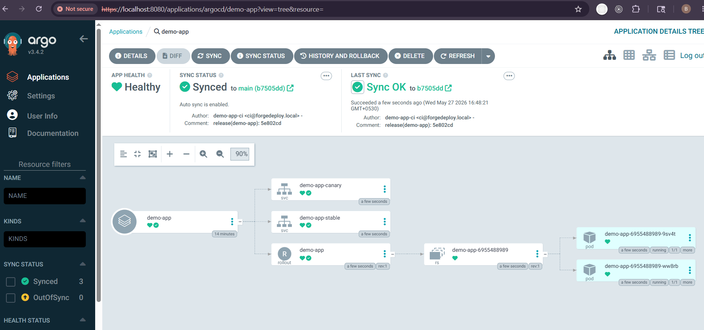

# 🔩 Forge-Deploy-Environment

GitOps environment repository for deploying `demo-app` to Kubernetes using **Argo CD** and **Argo Rollouts**.

This repository is the execution side of the Forge-Deploy control plane — it holds the manifests that Argo CD watches and applies. All changes to this repo are driven through pull requests, either manually or by the Forge-Deploy proposal system.

---

## 🖼️ Argo CD View



## What's in here

| File | Purpose |
|---|---|
| `apps/argocd/demo-app.yml` | Argo CD `Application` resource |
| `apps/demo-app/rollout.yaml` | Canary rollout strategy |
| `apps/demo-app/service-stable.yaml` | Stable traffic service |
| `apps/demo-app/service-canary.yaml` | Canary traffic service |
| `apps/demo-app/kustomization.yaml` | Kustomize entrypoint |

### Directory layout

```text
.
├── apps
│   ├── argocd
│   │   └── demo-app.yml
│   └── demo-app
│       ├── kustomization.yaml
│       ├── rollout.yaml
│       ├── service-stable.yaml
│       └── service-canary.yaml
└── README.md
```

---

## Manifest breakdown

### Argo CD Application — `apps/argocd/demo-app.yml`

Registers `demo-app` as an Argo CD-managed application in the `argocd` namespace.

- Source: this repository, path `apps/demo-app`
- Destination: `default` namespace, in-cluster API server
- Auto-sync on with `prune` and `selfHeal` enabled

### Rollout — `apps/demo-app/rollout.yaml`

Defines the Argo Rollout for `demo-app`:

- 2 replicas
- Image pulled from GHCR (`ghcr.io/shyaminda/demo-app:55fccf8`) using the `ghcr-pull` secret
- Canary strategy: shift 10% of traffic to the canary, then pause for verification before proceeding

### Services — `service-stable.yaml` / `service-canary.yaml`

Argo Rollouts uses two separate services to split traffic:

- `demo-app-stable` — receives the majority of traffic
- `demo-app-canary` — receives the canary slice

Both target pods labeled `app: demo-app` on port `3000`.

### Kustomize — `apps/demo-app/kustomization.yaml`

Bundles `rollout.yaml`, `service-stable.yaml`, and `service-canary.yaml` as a single Kustomize apply target.

---

## Prerequisites

- Kubernetes cluster (local or cloud)
- Argo CD installed in the cluster
- Argo Rollouts controller installed
- `kubectl` configured against the cluster
- Argo CD CLI and the Argo Rollouts `kubectl` plugin (optional but recommended)

---

## Deploying

### Recommended — via Argo CD

Apply the Argo CD Application manifest once, and let GitOps take over from there:

```bash
kubectl apply -f apps/argocd/demo-app.yml
```

Argo CD will detect the `apps/demo-app` path and sync all resources automatically.

### Alternative — direct kubectl apply

```bash
kubectl apply -k apps/demo-app
```

> This bypasses Argo CD and should only be used for local testing. In any real environment, always go through Argo CD so Git remains the source of truth.

---

## Rollout operations

```bash
# Check current rollout status
kubectl argo rollouts get rollout demo-app -n default

# Promote past the canary pause step
kubectl argo rollouts promote demo-app -n default

# Abort and revert to stable
kubectl argo rollouts abort demo-app -n default
```

---

## Releasing a new version

1. Update the image tag in `apps/demo-app/rollout.yaml`
2. Commit and push to `main`
3. Argo CD syncs the change (or trigger manually via UI/CLI)
4. Monitor the canary — 10% traffic shifts automatically
5. Promote once the canary is verified healthy

---

## Rollback procedure

Rollbacks follow the same GitOps path as any other change — through a branch and a PR, never by mutating the cluster directly.

**Step 1 — Find the last known-good version**

Check Argo CD history, Argo Rollouts status, or the incident timeline to identify the stable image tag. Then review recent commits:

```bash
git log --oneline --decorate -n 20
```

**Step 2 — Create a rollback branch**

```bash
git checkout -b rollback-incident-<timestamp>
```

**Step 3 — Revert the image tag**

Edit `apps/demo-app/rollout.yaml` to the stable image tag (e.g. `55fccf8`).

**Step 4 — Commit and open a PR**

```bash
git add apps/demo-app/rollout.yaml
git commit -m "rollback: revert to image <known-good-tag>"
```

Push and open a pull request. Merge it — Argo CD will reconcile the rollback automatically.

> This repo contains prior rollback branches that can serve as naming and process references.

---

## Troubleshooting

```bash
# Check Argo CD application state
kubectl get applications -n argocd

# Check rollout state
kubectl get rollout demo-app -n default
kubectl describe rollout demo-app -n default

# Check services
kubectl get svc demo-app-stable demo-app-canary -n default
```

---

## Notes

- Argo CD tracks the `main` branch
- Workloads deploy to the `default` namespace
- The `ghcr-pull` image pull secret must exist in the deployment namespace before applying

---

## Related Repositories

This repo is the execution layer of a three-repo system. Here's how each part fits together:

| Repo | Role |
|---|---|
| [Forge-Deploy](https://github.com/Buthsaraa/Forge-Deploy) | Control plane — evaluates SLOs, manages incidents, generates rollback/promotion proposals |
| **Forge-Deploy-Environment** | This repo — GitOps manifests applied by Argo CD to the cluster |
| [Forge-Deploy-Demo-App](https://github.com/Buthsaraa/Forge-Deploy-Demo-App) | Target workload — the app being deployed, observed, and governed |

When Forge-Deploy approves a rollback or promotion proposal, it opens a PR against **this repository**. Argo CD detects the merge and reconciles the cluster automatically — no direct cluster access required.

---

## License

No license defined.